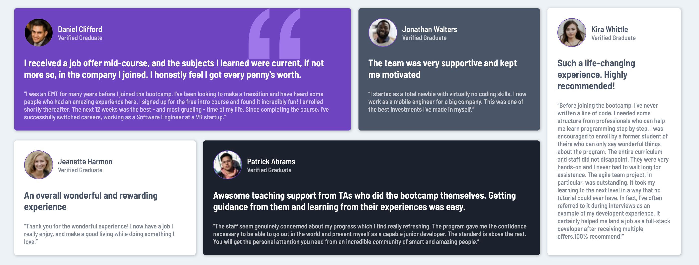

# Testimonials Grid Section Project

## Table of contents

- [Overview](#overview)
  - [The challenge](#the-challenge)
  - [Screenshot](#screenshot)
- [My process](#my-process)
  - [Built with](#built-with)
  - [What I learned](#what-i-learned)
  - [Continued development](#continued-development)
  - [Useful resources](#useful-resources)
- [Author](#author)

## Overview

### The challenge

Users should be able to:

- View the optimal layout for the site depending on their device's screen size

### Screenshot



## My process

### Built with

- HTML, CSS
- Visual Studio Code
- CSS Flexbox
- Mobile-first workflow

### What I learned

While working through this project, some of my major learnings were figuring out how to properly display each testimonial section on a website while styling each one with specific colors and fonts. Additionally, I learned how to utilize CSS Flexbox to my advantage in order to properly implement a mobile and desktop design.

```html
<h1>Some HTML code I'm proud of</h1>
<div class="header">
  
  <div class="header-txt">
    <p class="name">Daniel Clifford</p>
    <p>Verified Graduate</p>
  </div>
</div>
```
```css
@media (min-width: 576px) {
  #testimonial-grid-container, #main-left, #top, #bottom {
    display: flex;
    }
  #top, #bottom {
    flex-basis: 50%;
    }
}
```

### Continued development

In future projects, I plan on incorporating JavaScript so that I can make the project more interactive with the user. For instance, I can incorporate a styled button that alerts the user when clicked on. Additionally, I plan on learning more about frameworks and how I can use them to my advantage when building my next project.

### Useful resources

- [MDN Web Docs](https://developer.mozilla.org/en-US/) - This website acted as a dictionary and an important place for me to reference HTML and CSS properties. I highly recommened others to reference it as well as it allowed me to explore new ways to structure and refine my code.

## Author

### Danny Yu
